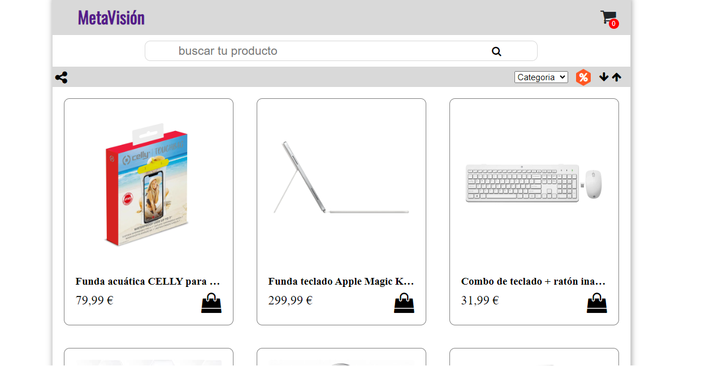

# E-Commerce-Metavision

Timeline:
 + Start: 10/04/2023
 + Sprint: 14/04/2023
 + Delivery: 20/04/2023
 
#
### Project Requirements:
MUST:
* Define the brand and products to be sold (Benchmark).
* Search for usability and design references (color palettes and fonts).
* Create mockups and wireframes.
* Define user stories and tasks that need to be done and prioritize them.
* Have a product section, a shopping cart, and a contact form.
* Include images where necessary (in appropriate formats).
* Be responsive for both mobile and desktop, specify chosen resolutions in each case.
* Utilize Sass (variables and mixing).

EXTRAS:
* Have the form email sent to an email address.
* Implement local storage.

Performance Criteria:
* Deliverables.
* Review audit criteria.
* Final work presentation guidelines.
* Good practice criteria.
* Use of Trello and implementation of agile methodologies.

Deliverables:
* Link to GitHub repository with Readme.
* Designs in Figma.
* Teamwork Trello board.
* Final presentation.
#

Tools:
+ [Trello Project](https://trello.com/invite/b/TXdfSsz7/ATTI414792cbc863d03575bd16aedb0cfdf892C51AC4/ecomerce-equipo2)
+ [Figma Project](https://www.figma.com/file/RnrP135gVGz8RTjcJ2VmP8/Untitled?node-id=0%3A1&t=HzzENDDmIrjSxk9n-1)
+ [Discord Project](https://discord.gg/EkuxQquM)

#
## Technology

## Team:
+ Scrum master: Kibria.
+ Product owner: Gabriela.
+ Developers:
    * Nacyla.
    * Juan Carlos.
 

    

    
    

Objective: An online store for selling electronic accessories, focusing on three specific sectors:
- Mobile accessories.
- Computer accessories.
- Metaverse accessories.

## Basic User Navigation UML (Unified Modeling Language)

