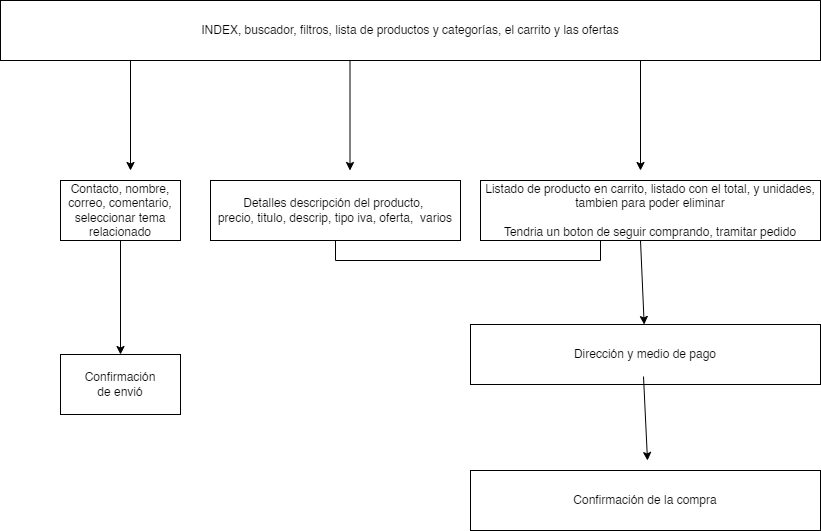

# ecomerce-equipo2
Equipo:
+ Scrum master: Kibria.
+ Product owner: Gabriela.
+ Developer:
    * Nacyla. 
    * Juan carlos.

Temporacización:
 + Inicio: 10/04/2023
 + Sprint: 14/04/2023
 + Entrega: 20/04/2023
#
### Contexto del proyecto
DEBE:
* Plantear la marca y los productos a vender (Benchmark)
* Buscar referencias de usabilidad y de diseño (paletas de colores y fuentes)
* Realizar mockups y wireframes.
* Definir las historias de usuario y tareas que necesitamos realizar y priorizarlas
* Tener una sección de productos, una de carrito de compra y un formulario de contacto.
* Incluir imágenes en los elementos que sea necesario (en formatos apropiados).
* Ser responsive para mobile y desktop, especificar resoluciones elegidas en cada caso.
* Utilización de Sass (variables y Mixing)

EXTRAS:
* Que el correo del formulario se mande a una dirección electrónica
* Local storage

Criterios de rendimiento
● Entregables
● Revisar los criterios de auditoría.
● Pautas de presentación final de trabajo.
● Criterios de buenas prácticas.
● Utilización del Trello e implementación de metodologías ágiles.

Entregables
* Enlace a repositorio GitHub con Readme.
* Diseños en Figma.
* Trello de trabajo en equipo.
* Presentación final.
#

Herramientas:
+ [Proyecto Trello]( https://trello.com/invite/b/TXdfSsz7/ATTI414792cbc863d03575bd16aedb0cfdf892C51AC4/ecomerce-equipo2)
+ [Proyecto Figma](https://www.figma.com/file/RnrP135gVGz8RTjcJ2VmP8/Untitled?node-id=0%3A1&t=HzzENDDmIrjSxk9n-1)
+ [Proyecto Discord](https://discord.gg/EkuxQquM)

#
## Tecnología

## Nombre de la tienda:
# METAVISION

Objetivo: tienda online para vender accesorios electrónicos, nos enfocamos en 3 sectores especifico:
- Accesorios de movil.
- Accesorios de ordenador.
- Accesorios de metaverso.

## Navegación basica de nuestro usuario

